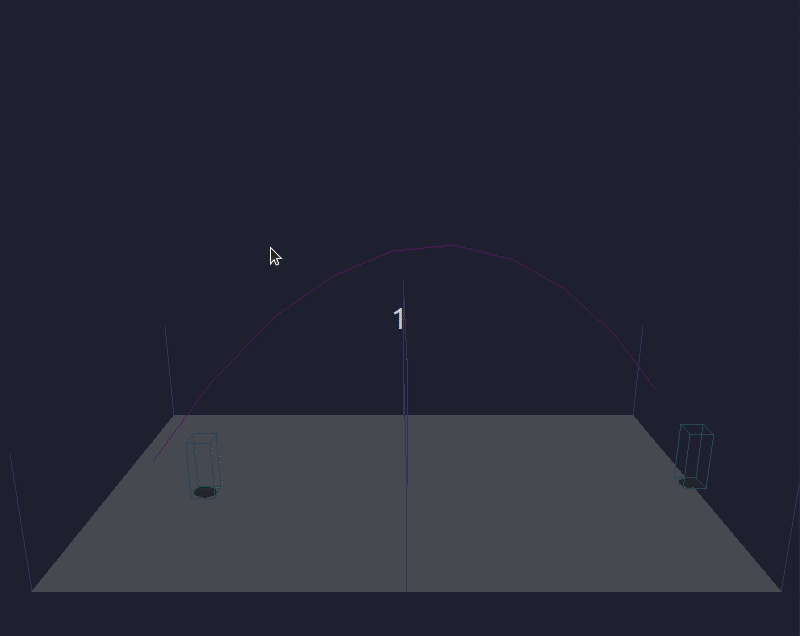
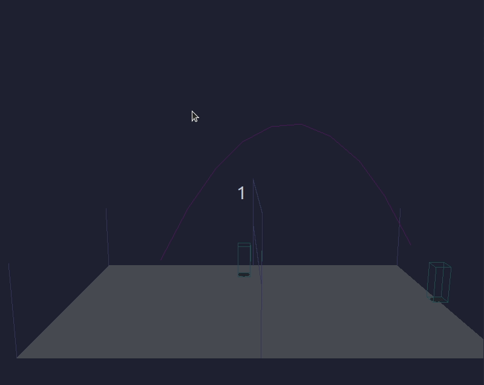
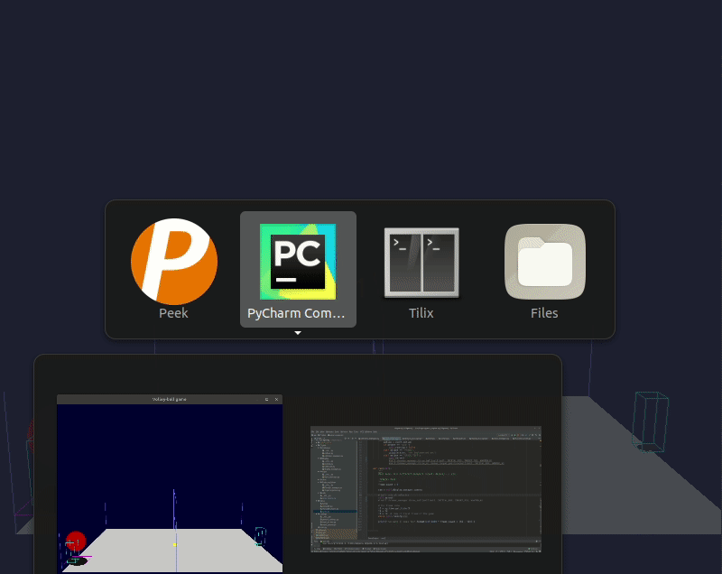
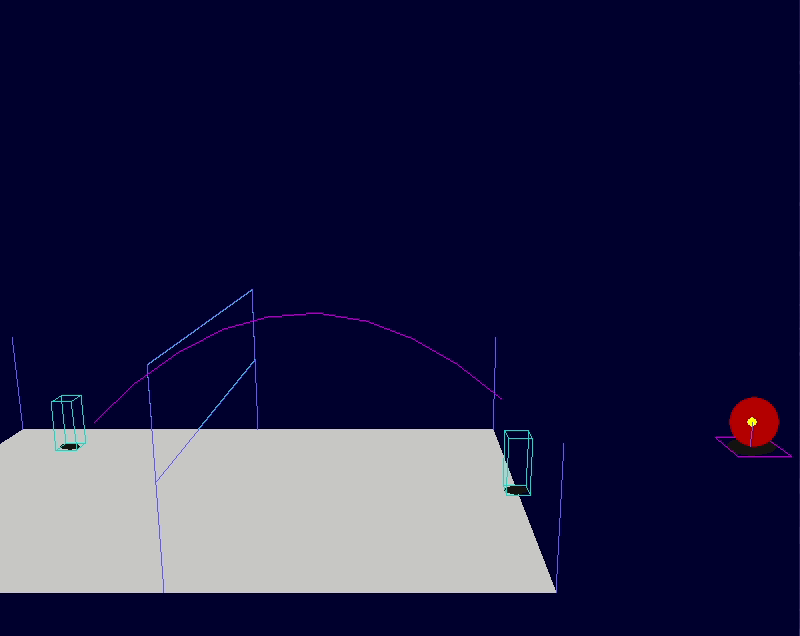
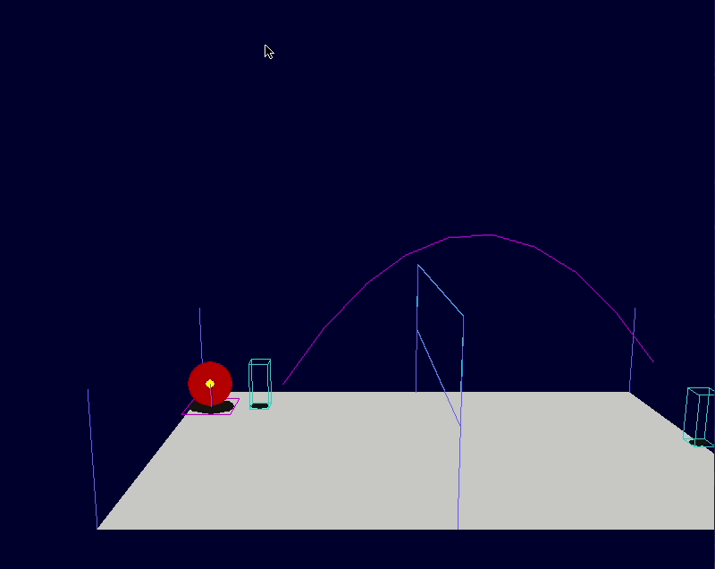

**WIP** : Simple 2D retro Volley-ball game written from scratch with Pygame and Python3.

Check [Projects](https://github.com/MiguelReuter/Volley-ball-game/projects) page on Github to see progress !


# Demo

Demo with debug display (simple shapes, not sprites yet).

The target ball position is **controllable** in these actions :
    - **throw**
    - **smash** (depth only)
    - **serve**

## Controls
 - **ZQSD** : move or choose target bal position
 - **i** : jump
 - **j** : smash
 - **Arrow keys** : move camera


## Throw ball


## Smash


## Serve


## Collisions with net
 


# Dependencies
- python3
- pygame 1.9.5
- pytest to run tests (optional)

# Launch game
```
python3 src/main.py
```

# Run tests (optional)
```
py.test .
```

# Licence

The code is under the MIT license terms.

<!-- Required extensions: pymdownx.betterem, pymdownx.tilde, pymdownx.emoji, pymdownx.tasklist, pymdownx.superfences -->