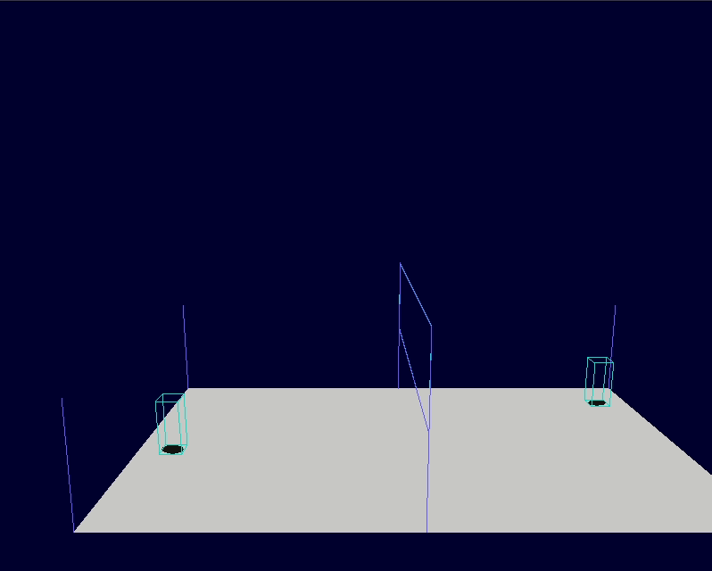
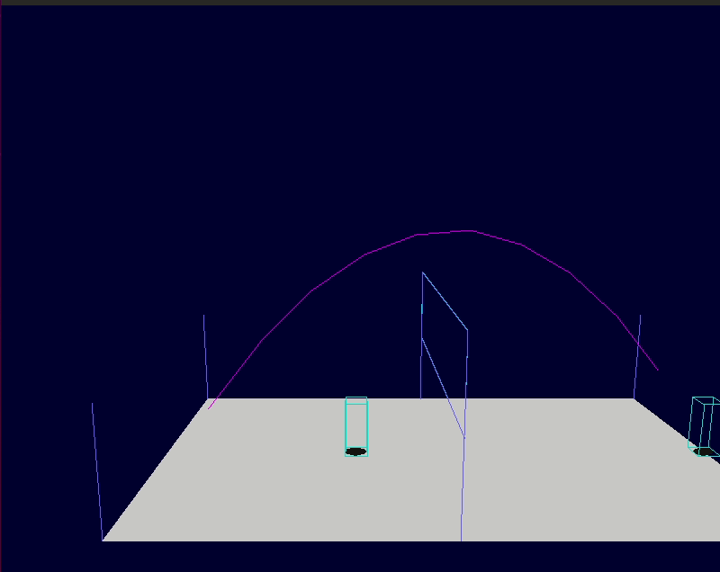

**WIP** : Simple 3D/2D retro Volley-ball game written from scratch with Pygame and Python3.

Check [Projects](https://github.com/MiguelReuter/Volley-ball-game/projects) page on Github to see progress !

**Game inspiration:** [Super Soccer SNES](https://en.wikipedia.org/wiki/Super_Soccer)


---

# Overview

## Features

- Debug display with simple shapes, not sprites yet
- Play against a **human player** or a **bot** !
- Basic actions:
    - move
    - jump
    - smash
    - serve
    - throw ball
    - dive
    - pause game
    - move camera (debug purpose)
- Rules (1V1):
    - ball does not touch ground in player area
    - ball does not cross space under net
    - player can touch a maximum of 3 times the ball consecutively

Notes:

1. Ball trajectory is **controllable** in these actions :
     - **throw**
     - **smash** (depth only)
     - **serve**
2. To change team composition, you must change code in `src/Engine/game_engine.py` in `create` method:

| teams composition                             | code to change                                                   |
|-----------------------------------------------|------------------------------------------------------------------|
|**human** (keyboard)  vs **human** (joystick)  |`self.new_game([PlayerId.PLAYER_ID_1, PlayerId.PLAYER_ID_2])`     |
|**human** vs **bot**                           |`self.new_game([PlayerId.PLAYER_ID_1, AIId.AI_ID_1])`             |
| **bot** vs **bot**                            |`self.new_game([AIId.AI_ID_1, AIId.AI_ID_2])` or `self.new_game()`|


## Demo
### Human player VS Bot


### Throw ball


### Smash


### Dive


### Serve


### Collisions with net
 


## Controls

Keyboard and Gamepad are supported. For gamepad, button binds could be different depending on your device button layout. You still must hardcode for joystick use.

| Action                                    | Key *(keyboard)*| Button *(gamepad)*|
|------------------------------------------ |---------------- |------------------ |
| **Move** or **Aim** during ball throwing  | ZQSD            | POV, D-PAD        |
| **Jump**                                  | I               | 2                 |
| **Throw** ball or **Smash**               | J               | 1                 |
| **Dive** to catch up ball (after smash...)| L               | 3                 |
| **Move** camera                           | Arrow Keys      | Right joystick    |
| **Re-throw** ball                         | Space bar       | 4                 |
| **Quit** game                             | Esc.            | 9                 |
| **Pause** game                            | P               | 10                |

You can manually change button binds in `src/Settings/input_presets.py` (pygame code key).

---

# Dependencies
- python3
- pygame 1.9.5
- pytest to run tests (optional)

# Launch game
```
python3 src/main.py
```

# Run tests (optional)
```
py.test .
```

# Licence

The code is under the MIT license terms.

<!-- Required extensions: pymdownx.betterem, pymdownx.tilde, pymdownx.emoji, pymdownx.tasklist, pymdownx.superfences -->