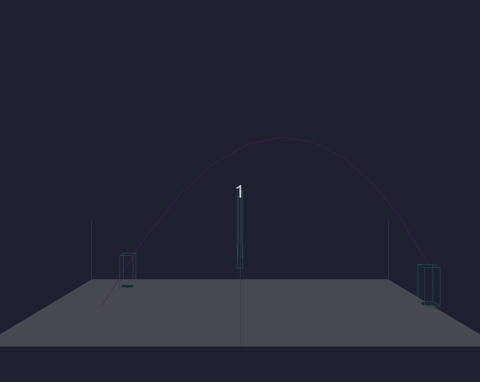

**WIP** : Simple 2D retro Volley-ball game written from scratch with Pygame and Python3.

Check [Projects](https://github.com/MiguelReuter/Volley-ball-game/projects) page on Github to see progress !


# Demo (only debug display)




# Dependencies
- python3
- pygame 1.9.5
- pytest to run tests (optional)

# Launch game
```
python3 src/main.py
```

# Run tests (optional)
To run tests :
```
py.test .
```

# Licence

The code is under the MIT license terms.
